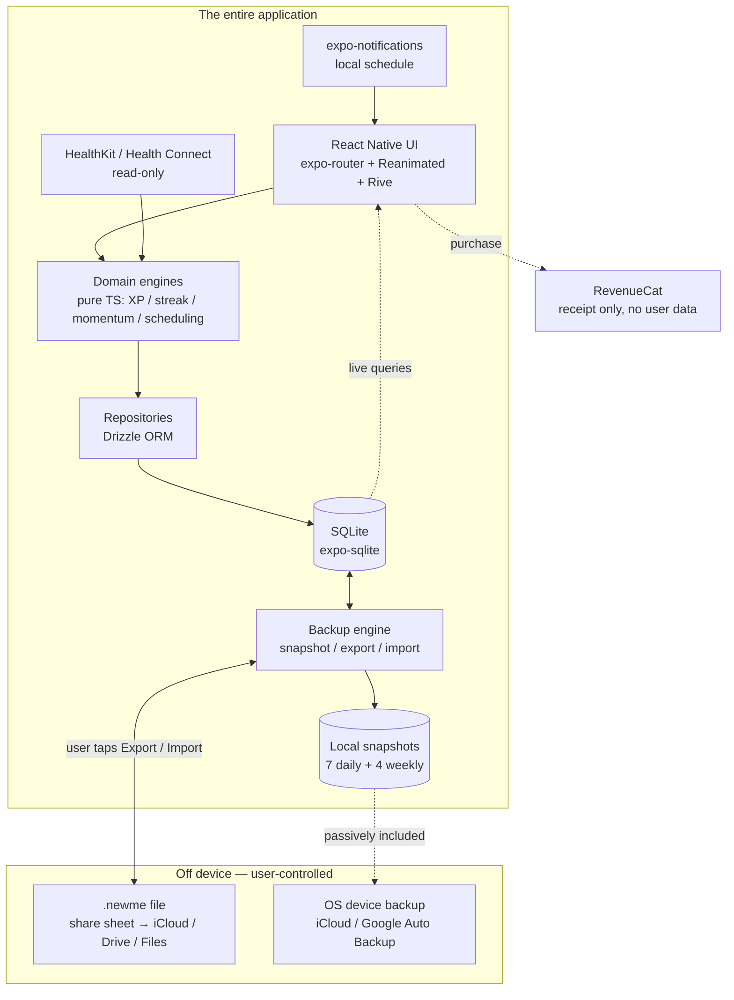

# NewMe — Product, Design & Technical Specification

> A daily-life operating system: habit tracking + day planning + an RPG progression layer where
> your character levels up from the things you actually do.
>
> **Codename:** `newme`
> **Doc version:** 1.1 · 2026-09-02
> **Status:** Pre-development design spec
> **Owner:** krnitish321@gmail.com
>
> **Architecture in one line:** 100% on-device. No backend, no accounts, no cloud sync, no AI.
> Data safety comes from a first-class export/import system (§8.3), not a server.

---

## Table of Contents

1. [Vision & Positioning](#1-vision--positioning)
2. [Competitive Research](#2-competitive-research)
3. [Behavioural Science Foundations](#3-behavioural-science-foundations)
4. [Product Feature Set](#4-product-feature-set)
5. [The Progression System (detailed design)](#5-the-progression-system-detailed-design)
6. [UX & Visual Design](#6-ux--visual-design)
7. [Technology Choices](#7-technology-choices)
8. [System Architecture](#8-system-architecture)
9. [Data Model](#9-data-model)
10. [Core Algorithms](#10-core-algorithms)
11. [Roadmap & Milestones](#11-roadmap--milestones)
12. [Monetisation](#12-monetisation)
13. [Success Metrics (without telemetry)](#13-success-metrics-without-telemetry)
14. [Risks, Ethics & Guardrails](#14-risks-ethics--guardrails)
15. [Open Questions](#15-open-questions)
16. [Sources](#16-sources)

---

## 1. Vision & Positioning

### 1.1 One-liner

**NewMe turns the life you're trying to build into a character you're actually levelling up.**

### 1.2 The problem

Three categories of app exist today and none is complete:

| Category | Examples | Strength | Gap |
|---|---|---|---|
| Coaching / wellbeing | Fabulous, Finch, Headspace | Behavioural science, guided programmes, beautiful onboarding | Progression is shallow; content-gated; you outgrow it |
| Gamified task RPG | Habitica, Habit Slayer, LevelUp Life | Deep progression, real motivation loop | No coaching, no day planning, cluttered UI, punishing mechanics |
| Day planners | Structured, Sunsama, TickTick | Time-blocking, calendar integration | Zero motivation layer, purely mechanical |

Nobody has combined **behaviourally-sound habit coaching + real daily planning + a progression system deep enough to care about**, without the whole thing turning into a chore.

### 1.3 Target user (v1: you, then people like you)

- 20–40, self-improvement oriented, plays or has played games
- Has already tried and abandoned 2+ habit apps (they got boring, or shaming)
- Wants *one* place for: what am I doing today, what am I building long-term, am I actually getting better

### 1.4 Product pillars

1. **Earned progression** — every XP point maps to a real action. No fake numbers, no busywork.
2. **Kind by default** — the app never punishes; failure triggers *recovery*, not damage.
3. **Instant & offline** — a habit check-off must feel like a game button, not a network request.
4. **Plan → Do → Reflect** — a daily closed loop, not just a checklist.
5. **Ownership** — your data lives on your device, in a format you can read, that you can move yourself.

### 1.5 Architectural decisions that are permanent, not phased

These are not "v3 someday" items. They are settled, and the whole design leans on them:

- **No backend. No server. Ever.** All data lives in on-device SQLite. There is no account, no login, no cloud sync, no server-side anything.
- **No AI features.** No coach, no LLM-generated summaries, no suggestions engine. Insights are computed locally with plain arithmetic (§10).
- **Data portability is the substitute for a cloud** — a first-class export/import system (§8.3) is how backup, restore and device-migration work. This makes it the highest-stakes feature in the product, not a settings-screen afterthought.

What this buys: zero infrastructure cost, zero ops, no privacy surface, no GDPR/DSAR burden, no auth bugs, no sync conflicts, and an app that works identically in a basement gym and on a plane. What it costs: no automatic multi-device sync, and **device loss without a recent export means data loss** — which §8.3 and §14 are built around mitigating.

### 1.6 Explicit non-goals

- Social feeds, guilds, friend parties, leaderboards
- A full task/project manager (no sub-projects, no Kanban, no assignees)
- Real-money in-game purchases (no pay-to-win economy, ever)
- Web app (mobile-first; and with no server there is nothing for a web app to read)

---

## 2. Competitive Research

### 2.1 Fabulous — what it gets right

Fabulous was founded in 2013 out of an incubator at Duke University with input from behavioural economist Dan Ariely, and is built explicitly on evidence-based behaviour change. Mechanics worth borrowing:

- **Journeys** — guided programmes of 3–12 weeks that add *one habit at a time*, in a deliberate order. This is the single strongest idea in the app.
- **Rituals** — habits are grouped into chained routines (Morning Ritual, Evening Ritual) run as a full-screen guided flow with timers, not isolated checkboxes.
- **Challenges** — short, focused 5–30 day pushes.
- **Coaching audio** — ~3-minute segments delivered at the right moment in a journey.
- **Onboarding that starts absurdly small** — habit #1 is literally "drink a glass of water tomorrow morning".

**What to avoid:** content is heavily paywalled and pacing is forced (you can't skip ahead); progression is entirely content-driven, so once the journeys run out there's no reason to stay.

### 2.2 Habitica — what it gets right

Habitica (founded 2013 by HabitRPG Inc., open source) models real life as an RPG: Habits, Dailies and To-Dos yield XP, gold and item drops; you level up, buy gear, unlock pets, skills and quests, and join parties and guilds.

Worth borrowing:
- Task taxonomy: **Habits (± , repeatable) / Dailies (scheduled) / To-Dos (one-off)** — a genuinely good ontology, keep it.
- Gold as a *separate* currency from XP, spendable on cosmetics **and on user-defined real-world rewards**.
- Quests that turn a group of tasks into a narrative arc.
- A class system that changes which stats matter to you.

**What to avoid:**
- **HP damage for missed Dailies.** Habitica's most-cited churn driver: a bad week compounds into a dying avatar and users quit rather than open the app. We replace damage with *Momentum decay* (§5.6).
- Dense, spreadsheet-like UI and a 2013-era art style.
- Party mechanics where *your* miss damages *your friends* — guilt as a retention mechanic is a dark pattern.

### 2.3 Others scanned

| App | Take-away |
|---|---|
| **Finch** | Pet-care framing makes self-care feel like caring for something else. Extremely gentle copy. Proof that "cute + kind" outperforms "hardcore". |
| **Streaks** (iOS) | Ruthless simplicity, a deliberate 12-habit cap, deep Health integration. Proof that constraint is a feature. |
| **Structured** | Best-in-class day timeline UI. Steal the interaction model for the Today screen. |
| **Habit Pixel** | Solo indie, launched May 2025 → $1K MRR in 8 months. Proof the niche still has room for a well-executed indie entrant. |
| **Duolingo** (adjacent) | Streak freezes, repairs and league seasons are now the industry-standard antidotes to streak anxiety. Copy the antidotes, not the guilt-tripping owl. |

### 2.4 The gap we are filling

```
                 shallow progression
                          |
        Fabulous ---------+--------- Structured
       (coaching)         |          (planning)
                          |
  kind  --------------- NewMe --------------- harsh
                          |
                          |
                      Habitica
                          |
                  deep progression
```

NewMe = **Fabulous's journeys + Structured's day timeline + Habitica's depth, with Finch's kindness.**

---

## 3. Behavioural Science Foundations

Every mechanic in §4 and §5 must trace back to one of these. If a feature doesn't, cut it.

### 3.1 Fogg Behaviour Model — B = MAP

Behaviour happens when **Motivation**, **Ability** and a **Prompt** converge. Design implications:

- We cannot reliably raise motivation → **maximise ability (reduce friction) and nail the prompt.**
- Check-off must be ≤1 tap from cold start, and also directly from the notification.
- Every habit gets an **anchor** ("after I brew coffee"), not just a clock time — anchors are stronger prompts.

### 3.2 Tiny Habits / the ramp

Start absurdly small; scale the *commitment* only once the behaviour is automatic. Implementation: habits have a **target that auto-ramps** (2 min → 5 min → 10 min meditation) on a schedule the user approves, rather than a static goal they keep failing.

### 3.3 Implementation intentions

"When situation X arises, I will perform response Y." Habits in NewMe are stored as a structured intention:

> **When** `<cue>` **at** `<time window>` **in** `<place>` **I will** `<behaviour>` **for** `<dose>`.

The creation flow requires these fields. It costs 20 extra seconds and materially improves adherence.

### 3.4 Time to automaticity

Lally et al. (UCL) found automaticity takes a **median ~66 days, range 18–254 days**, depending on behaviour complexity. Implications:

- Journeys must be ~9–12 weeks, not 21 days. The "21 days to a habit" myth sets users up to feel broken.
- The UI should show **automaticity progress**, not just streak count — a habit at day 70 with 85% adherence is *won*, even if the streak broke twice.

### 3.5 Self-Determination Theory (SDT)

Sustained motivation requires **autonomy, competence, relatedness**:

| Need | Mechanic |
|---|---|
| Autonomy | User authors their own habits, difficulty, rewards, cosmetics. Journeys are always skippable. Nothing is mandatory. |
| Competence | Levels, attributes, streaks, automaticity meter, weekly review showing real deltas. |
| Relatedness | The weakest of the three here, since there is no backend and no social graph by design. Served instead by **shareable progress cards** — an image of your week or a tier-up, generated on-device and handed to the system share sheet, so accountability happens in the user's existing group chat rather than in a network we have to operate. |

### 3.6 The extrinsic-motivation trap

Research and industry data converge on the same arc: extrinsic rewards (XP, badges) work well for **onboarding and the first ~30 days**; variable rewards sustain **days 30–60**; after ~day 60 users must be transitioned to **intrinsic satisfaction markers** or the reward system itself becomes the reason to quit.

**Design response — the three-phase reward curve:**

| Phase | Days | Dominant mechanic | UI emphasis |
|---|---|---|---|
| Ignition | 0–30 | Fixed XP + streaks + fast levels | Big numbers, particles, frequent level-ups |
| Variation | 30–60 | Variable loot drops, quests, boss weeks | Surprise, narrative |
| Internalisation | 60+ | Automaticity meter, identity statements, long-horizon stats | "You have been someone who runs, for four months." Levels visually recede. |

The app deliberately **turns the volume down on gamification as a habit matures.** This is the differentiator nobody else ships.

### 3.7 The "what-the-hell" effect

After one lapse, all-or-nothing thinkers abandon the whole goal. Countermeasures:

- Flexible streaks (X times/week, not consecutive days)
- Streak freezes and gold-funded repairs
- No red "FAILED" state — missed items go grey and "open", never red
- A miss immediately offers a **2-minute Recovery Quest** instead of a penalty

---

## 4. Product Feature Set

Legend: **[M]** = MVP / v1 · **[2]** = v2 · **[3]** = v3+

### 4.1 Habits & tasks

- **[M]** Three item types (Habitica-style ontology):
  - **Habit** — repeatable, unscheduled, ± (e.g. "drink water" +, "doomscroll" −)
  - **Daily** — scheduled recurring (specific weekdays, N×/week, every N days)
  - **Task** — one-off, optional due date
- **[M]** Implementation-intention fields: cue, time window, place, dose (§3.3)
- **[M]** Difficulty: Trivial / Easy / Medium / Hard / Epic → drives XP (§5.2)
- **[M]** Attribute tagging: each habit maps to 1–2 of the 5 attributes (§5.3)
- **[M]** Flexible frequency ("3× per week") with week-based streaks
- **[M]** Quantitative habits with units and targets (pages, km, minutes, glasses)
- **[M]** Timer habits — built-in focus timer that auto-completes the habit
- **[2]** Auto-ramping targets (§3.2)
- **[2]** Negative habits with a "days since" counter instead of a streak
- **[2]** Evidence attachment (photo / timer / health data) → XP multiplier
- **[3]** Habit template library and shareable habit packs

### 4.2 Rituals (chained routines)

- **[M]** Group habits into an ordered **Ritual** (Morning, Evening, Deep Work, Wind-down)
- **[M]** **Ritual Player**: full-screen, one card per step, per-step timer, swipe/tap to advance, background audio allowed, completes the whole chain in one flow
- **[2]** Per-step audio coaching and breathing animations
- **[2]** Ritual streak as a first-class streak, separate from individual habits

### 4.3 Daily planning

- **[M]** **Today** screen: a vertical time-blocked timeline merging scheduled dailies, rituals, tasks and free blocks (Structured-style)
- **[M]** Drag to reschedule within the day; "push to tomorrow"
- **[M]** **Plan Tomorrow** flow inside the evening ritual → planning tomorrow tonight grants an XP multiplier (§5.2), because pre-commitment is the highest-leverage single behaviour in the app
- **[2]** Device calendar read (busy blocks) via `expo-calendar`
- **[2]** Weekly review: adherence heatmap, attribute deltas, suggestions on what to drop or add
- **[3]** Two-way calendar write-back

### 4.4 Journeys (guided programmes)

- **[2]** A Journey = an ordered list of **steps** over 6–12 weeks. Each step unlocks a habit, sets a target and delivers a short piece of coaching content (text/audio ≤3 min).
- **[2]** Journey progress **gates** the next habit — you cannot add habit 4 until habit 3 holds ≥70% adherence for 7 days. (Anti-overcommitment; over-adding is the #1 reason habit apps fail.)
- **[2]** Launch set: *Foundation* (sleep/water/movement, 8 wk), *Deep Work* (6 wk), *Strength* (12 wk), *Calm* (6 wk)
- **[3]** Journey authoring tool / community journeys

### 4.5 Progression (the RPG layer) — full detail in §5

- **[M]** Character with level, XP and 5 attributes
- **[M]** Avatar that visually evolves through tiers
- **[M]** Streaks with freezes and repair
- **[M]** Gold + cosmetic shop + user-defined real-world rewards
- **[M]** Momentum (the anti-HP system) and Rescue Mode
- **[2]** Quests and weekly Boss fights
- **[2]** Loot drops (variable reward schedule)
- **[2]** Titles and achievements
- **[3]** Seasons / Chapters (12-week cosmetic tracks)
- **[3]** Skill tree with real perks (extra freeze slot, larger daily XP cap, …)

### 4.6 Insights

- **[M]** Per-habit: streak, adherence %, calendar heatmap, best time-of-day
- **[M]** **Automaticity meter** — 0–100 estimate of how automatic a habit has become (§10.4)
- **[2]** Attribute radar chart over time
- **[2]** Correlations ("your focus sessions run 40% longer on days you slept ≥7 h") — needs health data; computed locally with a plain correlation coefficient, no model involved

All insights are derived by querying the local event log. Nothing is computed off-device.

### 4.7 Reminders & prompts

- **[M]** Local scheduled notifications per habit/ritual, with quiet hours
- **[M]** **Actionable notifications** — Done / Snooze 15 m / Skip today, straight from the notification
- **[M]** Notification budget: a hard cap (default 6/day) so the app can never become noise
- **[2]** Smart timing: shift the reminder toward the user's historically successful completion time
- **[3]** iOS Home Screen widgets + Live Activity for a ritual in progress; Android Glance widget

### 4.8 Integrations

- **[2]** Apple HealthKit / Android Health Connect: steps, workouts, sleep, mindful minutes → **auto-complete** matching habits
- **[3]** Screen Time / Digital Wellbeing for negative habits
- **[3]** Wearables via Health only (no direct Garmin/Whoop SDKs — not worth the maintenance)

### 4.9 Data safety, export & import

The whole of §8.3 specifies this. Feature-level summary:

- **[M]** **Automatic local snapshots** — a rolling set of on-device backups (7 daily + 4 weekly), taken silently. Protects against corruption, a bad import, or a bug. Does *not* protect against losing the phone.
- **[M]** **Export** — one tap produces a `.newme` file (a ZIP: manifest + JSON + media) and opens the system share sheet, so the user saves it to iCloud Drive / Google Drive / Files / email — wherever they want.
- **[M]** **Import** in two modes: **Restore** (wipe and replace) and **Merge** (union by id, newest definition wins, then rebuild). A safety snapshot is always taken automatically before either.
- **[M]** **Backup nudge** — if the last export is older than 14 days, a gentle, dismissible prompt. Escalates in tone only once, then goes quiet.
- **[M]** **Plain JSON + CSV export** alongside the `.newme` file, so the data is readable in any text editor or spreadsheet without this app.
- **[M]** Onboarding states plainly, once: *"Everything stays on this phone. Nothing is uploaded. That means backups are on you — here's the one-tap button."*
- **[2]** Optional passphrase encryption of the export file
- **[2]** Device migration flow: export on the old phone → import on the new one, with a checklist

**Multi-device is manual and honest.** Two phones can be kept roughly in step by exporting from one and merging into the other. The app will say exactly that rather than pretending to sync.

---

## 5. The Progression System (detailed design)

This is the core differentiator. It is specified numerically so it can be unit-tested and tuned.

### 5.1 Design constraints

1. **Every point of XP maps to a real-world action.** No login bonuses, no ad-watching XP.
2. **The system must be un-gameable enough to stay meaningful to its only auditor: you.**
3. **Failure never subtracts XP or levels.** Progress is monotonic — only its *rate* changes.
4. **The ceiling is multi-year.** Level 50 ≈ 1 year of consistent use; level 100 ≈ 4–5 years.
5. **Gamification volume decreases as habits mature** (§3.6).

### 5.2 XP formula

```
effectiveXP = round( baseXP × Mstreak × Mplan × Mwindow × Mevidence )   → then daily cap
```

**Base XP by difficulty**

| Difficulty | Base XP | Guidance |
|---|---:|---|
| Trivial | 5 | <2 min, zero resistance (take vitamins) |
| Easy | 10 | <10 min, low resistance (make bed, 10 push-ups) |
| Medium | 20 | 10–30 min or moderate resistance (gym, 30 min reading) |
| Hard | 35 | 30–90 min or high resistance (deep work block, long run) |
| Epic | 60 | Rare. ≥90 min or very high resistance (race, exam, shipped feature) |

**Multipliers**

| Multiplier | Value | Condition | Rationale |
|---|---|---|---|
| `Mstreak` | `1 + min(streak, 30) × 0.02` → max **1.60** | Current streak on that habit | Rewards consistency; caps at 30 d so streak anxiety plateaus |
| `Mplan` | **1.15** | Item was in the day plan *before* the day started | Pre-commitment is the highest-leverage behaviour |
| `Mwindow` | **1.10** | Completed inside the declared time window | Strengthens the implementation intention |
| `Mevidence` | **1.10** | Timer ran, photo attached, or auto-completed from Health | Rewards honesty and enables verification |

Total multiplier is clamped to **2.0**.

**Daily soft cap (anti-grind)** — applied to the running daily total of effective XP:

| Band | Rate |
|---|---|
| 0 – 150 XP | 100% |
| 150 – 300 XP | 50% |
| > 300 XP | 10% |

The UI shows "raw earned / banked", so the cap is transparent and never a silent nerf.

**Negative habits:** tapping "−" yields **0 XP and 0 penalty**. It increments a counter and drops Momentum by 2. Never subtract XP — see constraint 3.

### 5.3 Attributes

Five attributes, each with its own level track. Every habit is tagged with 1–2.

| Attribute | Covers | Example habits |
|---|---|---|
| **Vitality** | Body, health, sleep, nutrition | Gym, run, 7 h sleep, water, no junk food |
| **Focus** | Deep work, learning, output | Deep work block, study, ship code, read |
| **Discipline** | Order, finances, chores, resisting | Make bed, inbox zero, budget review, no doomscroll |
| **Spirit** | Mind, calm, reflection | Meditate, journal, gratitude, walk without phone |
| **Bond** | Relationships and contribution | Call family, date night, help someone, teach |

Attribute XP = the same `effectiveXP`, awarded in full to **each** tagged attribute (a 2-tag habit "spends" its XP twice into attributes — attributes are a *lens* on the same actions, not a competing budget).

Attribute level curve (flatter, since each attribute receives only a share of total XP):

```
attrXPTotal(L) = round( 2.5 × (L^2.3 − 1) )
```

**Why attributes matter:** they turn the vague goal "improve" into a visible, unbalanced radar chart. A user sitting at Focus 22 / Bond 4 is confronted with a truth no streak counter can show. This is the single best insight surface in the app.

### 5.4 Character level curve

```
totalXPForLevel(L) = round( 6 × (L^2.3 − 1) )        // cumulative XP to reach level L
xpForNextLevel(L)  = totalXPForLevel(L+1) − totalXPForLevel(L)
```

| Level | Cumulative XP | XP to next level | ≈ time to reach\* |
|---:|---:|---:|---|
| 2 | 24 | 45 | day 1 |
| 5 | 237 | 127 | ~3 days |
| 10 | 1,191 | 294 | ~2 weeks |
| 15 | 3,036 | 487 | ~1 month |
| 20 | 5,889 | 701 | ~2 months |
| 25 | 9,843 | 930 | ~3 months |
| 30 | 14,975 | 1,173 | ~4.5 months |
| 40 | 29,027 | 1,696 | ~8 months |
| 50 | 48,499 | 2,260 | ~13 months |
| 75 | 123,245 | 3,813 | ~2.6 years |
| 100 | 238,858 | 5,530 | ~4.7 years |

(Values verified against `round(6 × (L^2.3 − 1))`; this table is the golden fixture for the engine test.)

\* assuming ~80 XP/day early, ramping to ~140 XP/day as habit count and streak multipliers grow.

The exponent **2.3** is the single tuning knob. It lives in one constant, `LEVEL_CURVE_EXPONENT`, covered by a golden-file test so any change is deliberate and visible in a diff.

### 5.5 Avatar evolution

The character is not a sword-wielding hero — it is **a stylised figure that visibly becomes more capable, more detailed and more luminous.** Tier changes every ~10 levels are the big emotional beats.

| Tier | Levels | Name | Visual change |
|---|---|---|---|
| I | 1–9 | Ember | Faint outline, muted palette, no aura |
| II | 10–19 | Kindled | Solid form, first colour accent, faint aura |
| III | 20–29 | Forged | Detailed silhouette, gear slot 1 unlocked |
| IV | 30–39 | Tempered | Animated aura, gear slots 2–3, environment appears |
| V | 40–54 | Ascendant | Dynamic lighting, particle trail, full environment |
| VI | 55–74 | Luminary | Custom environment reflecting dominant attribute |
| VII | 75+ | Mythic | Fully bespoke, seasonal variants |

**Attribute-driven appearance:** the dominant attribute tints the aura and environment (Vitality = warm amber, Focus = cold blue, Discipline = steel white, Spirit = violet, Bond = green). A *balanced* character earns a prismatic aura — visibly rarer and better looking than a specialised one. **The art rewards balance without any rule enforcing it.**

**Implementation:** a single **Rive** state machine driven by `{ tier, dominantAttr, balanceScore, momentum, equipped[] }`. One parameterised artboard — far cheaper than authoring seven avatars.

### 5.6 Momentum — the anti-HP system

Habitica's HP damage is replaced by **Momentum**, a 0–100 gauge.

| Event | Δ Momentum |
|---|---:|
| Complete a scheduled item | +3 |
| Complete a whole ritual | +8 |
| Miss a scheduled item | −6 (max −18/day) |
| A day with zero activity | −10 |
| Negative habit logged | −2 |
| Complete a Recovery Quest | +15 |

**States**

| Range | State | Effect |
|---|---|---|
| 80–100 | **Flow** | +10% XP; aura at full intensity |
| 50–79 | Steady | Normal |
| 25–49 | **Fading** | Avatar desaturates; app surfaces a Recovery Quest |
| 0–24 | **Dormant** | Avatar dims; app switches to **Rescue Mode** |

**Rescue Mode** is the most important behavioural feature in the whole app. When Momentum hits Dormant, NewMe does the opposite of punishing:

1. Hides everything except **one** habit — the easiest one the user has ever succeeded at.
2. Copy: *"Let's just do this one. That's the whole day."* Never "you failed", never a broken-streak count.
3. That single completion is worth **3× XP** and **+15 Momentum**.
4. Streaks are automatically frozen for the Dormant period — no cascading loss.

Rescue Mode directly attacks the what-the-hell effect (§3.7) and is the mechanic that decides whether users come back after a bad week.

### 5.7 Streaks

- **Consecutive streak** for daily habits; **week streak** for N×/week habits (a week counts if the target is met, regardless of which days).
- **Streak Freeze tokens:** earn 1 per completed 7-day streak, hold max 3. Auto-consumed on a miss, with a *post-hoc* notification ("a freeze saved your 34-day streak").
- **Repair:** within 48 h, spend gold — `50 × ceil(streak / 10)` — to restore a broken streak. Once per habit per 30 days.
- **Never shown in red.** A broken streak reads: *"31 days. That was real. Start the next one."*
- Streak display is **de-emphasised after day 60**, replaced by the automaticity meter (§3.6, §10.4).

### 5.8 Gold, loot and the shop

- **Gold** = `round(effectiveXP / 5)`. The only earn path is real completions.
- **Spend on:** cosmetics (avatar gear, auras, environments, app themes), streak repairs, extra freeze tokens, and **user-defined real-world rewards** — Habitica's best idea ("2 hours of guilt-free gaming — 400 g").
- **Loot drops (v2):** variable-ratio reward. Each completion has `p = 0.08` (0.15 if streak ≥ 7) to drop a cosmetic shard. Rarity roll: Common 70 / Rare 22 / Epic 7 / Legendary 1. This is the days-30–60 engagement mechanic from §3.6.
- **Hard rule: no real-money purchase of gold, gems, XP or loot.** The economy's entire value is that it was earned. Monetisation is subscription-only (§12).

### 5.9 Quests and Bosses (v2)

- **Quest** — a narrative arc over 1–4 weeks bound to specific habits, with a milestone reward (cosmetic set + title). Journeys (§4.4) supply the coaching; Quests supply the reward structure.
- **Weekly Boss** — auto-generated from your own top habits. `Boss HP = Σ(planned completions) × 10`; each completion deals `10 × difficultyMultiplier` damage. Beat it before Sunday 23:59 → bonus gold + a loot roll. Fail → *nothing bad happens*; the boss simply "escapes". Loss aversion without punishment.
- **Recovery Quest** — 1 trivial habit, 2 minutes, triggered by Fading/Dormant momentum.

### 5.10 Seasons / Chapters (v3)

12-week **Chapters** with a cosmetic reward track. Chapter progress resets each season; **character level and attributes never reset.** This gives long-term users a fresh goal without invalidating years of progress — and 12 weeks maps neatly onto journey length (§3.4).

---

## 6. UX & Visual Design

### 6.1 Information architecture

```
Tabs
├── Today        ← default. Timeline + quick-complete. ~80% of usage lives here.
├── Habits       ← manage habits/rituals, heatmaps, per-habit stats
├── Character    ← avatar, level, attributes, inventory, shop, quests
├── Journeys     ← active programme, next step, coaching content        [v2]
└── Insights     ← trends, radar, weekly review, correlations
```

Plus two full-screen modal flows that carry the emotional weight:

- **Ritual Player** — one step per card, timer, ambient audio, haptics
- **Level-Up / Tier-Up** — a ~3-second celebration; interruptible, never blocking

### 6.2 The Today screen (most important surface)

```
┌─────────────────────────────────┐
│  Tue 2 Sep       Momentum  78   │
│  Lv 23  ████████░░  640 / 888   │  ← thin, always-visible progress
├─────────────────────────────────┤
│  MORNING RITUAL     4 steps  >  │  ← one tap starts the player
├─────────────────────────────────┤
│  07:00  o  Run 5k         +35   │
│  09:00  o  Deep work 90m  +35   │
│  12:30  •  Water  6/8      +5   │  ← inline stepper for quantitative
│  18:00  o  Gym            +20   │
│  21:30  o  EVENING RITUAL   >   │
├─────────────────────────────────┤
│  Later / unscheduled            │
│         o  Call mum       +20   │
└─────────────────────────────────┘
```

Interaction rules:

- **One tap to complete. No confirmation dialog, ever.** Undo via a 5-second snackbar.
- Completion animation: checkmark morph + haptic + the XP number flies into the level bar. Total ≤ 400 ms. *This micro-moment is the product — over-invest in it.*
- Long-press → quick sheet (edit dose, add note, reschedule, skip today).
- Missed items go **grey and sink down the list**. Never red, never a badge count.

### 6.3 Visual direction

- **Mood:** calm, dark-first UI with a single luminous accent that shifts with your dominant attribute. Think *Structured's clarity + Monument Valley's palette*, not pixel-art fantasy.
- **Type:** one geometric sans for UI, one distinctive display face for numbers and levels. Numbers are the hero — tabular figures everywhere.
- **Colour tokens:** semantic only (`surface`, `surface-raised`, `accent`, `attr-vitality`, …). Never a raw hex in a component.
- **Light and dark** both first-class. Dark is default.
- **Motion principles:**
  - Utility motion ≤ 200 ms, spring-based (Reanimated `withSpring`)
  - Reward motion ≤ 1500 ms, always skippable
  - Nothing ever blocks input
  - Honour `prefers-reduced-motion` → celebrations degrade to a static badge

### 6.4 Onboarding (the first 90 seconds decide everything)

1. "What do you want to become?" → pick 1–3 **identity cards** (*Someone who's fit / focused / calm / present*). Identity-based, not goal-based.
2. Auto-suggest **exactly one** starter habit per identity, pre-filled with an absurdly small dose.
3. Set the cue and time window (implementation intention, §3.3).
4. **Complete one habit right now** — "drink a glass of water" — and watch the first level-up fire before the user has created an account.
5. Ask for notification permission *after* the first level-up, framed as "when should I nudge you?"

No account, no paywall, no email capture in the first session.

### 6.5 Accessibility

- All interactive targets ≥ 44 pt; full VoiceOver/TalkBack labels including XP values
- Dynamic Type up to XXL; layouts reflow, never truncate
- Colour is never the only signal (icon + text for every state)
- Reduced-motion and reduced-transparency honoured
- Haptics fully disableable

---

## 7. Technology Choices

### 7.1 Decision summary

| Layer | Choice | Why |
|---|---|---|
| App framework | **Expo (React Native), TypeScript, New Architecture** | Most mature cross-platform path in 2026; EAS Build compiles iOS **from Windows** — decisive, since your dev machine is Windows 11. Biggest library ecosystem. |
| Navigation | **expo-router** (file-based) | Typed routes, deep links for free, needed for notification → screen jumps |
| Local database | **expo-sqlite + Drizzle ORM** (`useLiveQuery`) | The *only* datastore. Drizzle gives typed SQL, reactive queries and versioned migrations — and migrations matter more here than usual, because import must replay them (§8.3.4). |
| Client state | **Zustand** (UI/ephemeral) + Drizzle live queries (data) | No Redux ceremony; data lives in SQLite, not in a store. No server-state library is needed at all — there is no server state. |
| Backend | **None.** | See §1.5. No Supabase, no Firebase, no auth, no sync engine, no Edge Functions. This deletes roughly 40% of the work an app like this normally carries. |
| Backup / transfer | **expo-file-system** + **expo-sharing** + **expo-document-picker** + **fflate** (zip) + **expo-crypto** (SHA-256) | The export/import system (§8.3) replaces the entire cloud tier. `fflate` is pure JS, tiny and fast — no native module needed. |
| Animation | **Reanimated 4** + **react-native-gesture-handler**; **Skia** for XP bars/particles; **Rive** for the avatar state machine | Reanimated runs on the UI thread → 60/120 fps check-off animation. Rive's state machine is exactly the right tool for a parameterised evolving avatar. |
| Styling | **Unistyles 3** (or NativeWind v4) + a hand-rolled token set | Compile-time themes, no runtime style cost, full control over the visual identity |
| Notifications | **expo-notifications** (local, scheduled) | Local notifications need no server and work offline. With no backend there are no push notifications at all — and a habit app genuinely does not need them. |
| Health | **react-native-health** (HealthKit) + **react-native-health-connect** (Android), via config plugins + dev build | Auto-completion of movement/sleep habits. Device-local, reads only — fits the no-backend model perfectly. |
| Payments | **RevenueCat** | Only third-party service in the app, and it never sees habit data — just a receipt. Free under $2,500 MTR, then 1%. Entitlement is cached locally so a flaky network never locks out a paying user. |
| Crash reporting | **Sentry**, opt-in, off by default | Stack traces only, never user content. Drop it entirely if you're the only user. |
| Product analytics | **None.** | With no backend and a privacy-first pitch, shipping telemetry would contradict the product. Success is measured in-app instead (§13). |
| Build/CI | **EAS Build + EAS Update** (OTA) + GitHub Actions | Cuts mobile DevOps overhead ~60–70% for a solo dev; OTA lets you ship JS fixes without store review |
| Testing | **Vitest** (domain), **React Native Testing Library** (components), **Maestro** (E2E) | Domain engines are pure functions → fast, exhaustive unit tests |
| Error budget | **expo-dev-client** dev builds from day one | You will need native modules (health, widgets, Rive); Expo Go alone will not carry you |

### 7.2 Why Expo/React Native over the alternatives

| Option | Verdict |
|---|---|
| **Expo / React Native** ✅ | Windows-friendly (EAS builds iOS in the cloud, no Mac needed), largest ecosystem, New Architecture (JSI + Fabric) closed most of the performance gap, best solo-dev velocity. **Chosen.** |
| Flutter | Genuinely better for heavy custom graphics and pixel-identical UI. But you still need a Mac or a paid CI to ship iOS, the health/widget/Rive plugin story is thinner, and Dart's ecosystem is smaller. The animation edge is not worth the ecosystem cost here — and Skia is available to RN anyway. |
| Native (SwiftUI + Compose) | Best possible feel, best widgets/Live Activities. Two codebases, needs a Mac, ~2× the work. Wrong call for a solo builder shipping v1. |
| PWA / web-first | Rejected outright: no reliable iOS background notifications, no HealthKit, no widgets, no store presence. A habit app that cannot reliably prompt is not a habit app. |
| Lynx / newer frameworks | Too early. Not for something you intend to maintain for years. |

### 7.3 Why local-only is the right call here

A habit app is opened in a lift, on a run, in a basement gym. Any check-off that awaits a network round-trip feels broken and gets abandoned. Local-first is therefore mandatory for the *experience*. Going all the way to **local-only** is a further choice, and a good one for this product:

- **SQLite is authoritative, full stop.** There is no second source of truth to reconcile against, so an entire class of bug (sync conflicts, partial writes, stale caches, "which version is real") simply does not exist.
- **The app never awaits the network for anything.** There is nothing to await.
- **No account means no onboarding friction** — no sign-up wall, no password reset, no OAuth edge cases, no "verify your email" before you can tick a box.
- **No liability.** You never hold anyone's habit history, mood notes or health-derived data. There is no breach to have, no subject-access request to answer, no data-processing agreement to write.
- **No running cost.** The marginal cost of a user is zero, which is what makes a one-time purchase viable (§12).

**The honest trade-off:** no automatic multi-device sync, and if the phone is lost with no recent export, the data is gone. This is a real cost and the app must be candid about it rather than burying it. Everything in §8.3 exists to make the export path so easy that it actually gets used, and §14 treats data loss as the product's top risk.

**Design consequence:** because there is no server to fix things later, **the local schema, the migration chain and the export format are the durable contracts.** Get those right; the UI can be rewritten any time.

### 7.4 Project structure

```
newme/
├── app/                          # expo-router routes (thin: layout + wiring only)
│   ├── (onboarding)/
│   ├── (tabs)/
│   │   ├── today.tsx
│   │   ├── habits.tsx
│   │   ├── character.tsx
│   │   └── insights.tsx
│   ├── ritual/[id].tsx           # full-screen ritual player
│   └── _layout.tsx
├── src/
│   ├── domain/                   # PURE TypeScript. Zero React, zero RN imports.
│   │   ├── xp/                   # XP formula, level curve, caps
│   │   ├── streak/               # streak, freeze, repair rules
│   │   ├── momentum/             # momentum + rescue mode
│   │   ├── scheduling/           # "what is due today" resolver
│   │   ├── quest/
│   │   └── __tests__/            # the majority of the test suite lives here
│   ├── data/
│   │   ├── db/                   # drizzle schema, migrations, client
│   │   ├── repos/                # repository per aggregate
│   │   └── backup/               # snapshot, export, import, merge, integrity
│   ├── features/                 # feature-sliced UI (today/, habits/, character/…)
│   ├── ui/                       # design system: tokens, primitives, motion
│   └── lib/                      # notifications, health, haptics, analytics
├── assets/                       # rive/, audio/, fonts/, images/
├── drizzle/                      # generated migrations (committed)
└── docs/
```

**The critical rule:** `src/domain` never imports from React, React Native or the database. The XP engine is a pure function of `(state, event) → state'`. That makes it exhaustively unit-testable and fully replayable — which is what lets an import rebuild every derived number from scratch (§8.3.4) and lets you retune the curve years later without corrupting anyone's history.

---

## 8. System Architecture

### 8.1 High-level

Everything inside the phone. The only things crossing the device boundary are a purchase receipt and a backup file the user moves by hand.



### 8.2 Event sourcing for progression

Progression state (**XP, level, gold, attributes, streaks, momentum**) is **never stored as the source of truth.** The source of truth is an append-only `events` log; everything else is a derived, cached projection.

```
events (append-only, immutable)
   habit.completed / habit.uncompleted / task.completed
   ritual.completed / plan.created / negative.logged
   quest.claimed / purchase.made / freeze.consumed
        │
        ▼
  reduce(events) → projection
        │
        ▼
  character_state, habit_streaks, daily_totals  (cached tables, rebuildable)
```

Why this matters even more without a backend:

1. **The export becomes trivially correct.** A backup is essentially "the event log + the definitions". Derived state is rebuilt on import rather than shipped, so an export can never contain an inconsistent level/XP/streak snapshot. This eliminates the nastiest class of restore bug: a file whose numbers disagree with its history.
2. **Merge-on-import works without conflict resolution.** Append-only logs union cleanly — dedupe by `id` (UUIDv7 is time-sortable), sort by `occurred_at`, replay. Two phones can be combined without inventing a conflict-resolution policy.
3. **Rule changes are retroactive.** Tune `LEVEL_CURVE_EXPONENT`, replay the log, and history stays consistent. Without this, any balance change either corrupts old data or needs a bespoke migration script — and with no server you cannot fix a bad migration remotely.
4. **Undo is free.** Emit a compensating event.
5. **Insights are free.** Every analytical question is a query over the event log.
6. **Corruption is survivable.** If a projection is ever wrong, the fix is a rebuild, not a support ticket you cannot answer.

Cost: you must write and maintain a reducer plus a rebuild path. For a local-only progression system this is unambiguously worth it — and retro-fitting event sourcing later is a rewrite.

**Projection rebuild:** `rebuildProjections()` truncates cache tables and replays the log. Runs on schema version bump, on sync merge, and behind a debug-menu button. Must complete in <1 s for 3 years of events (~50 k rows) — validated by a benchmark test.

### 8.3 Backup, export & import — the system that replaces the cloud

With no server, this subsystem carries the entire weight of data safety. It gets the same rigour a sync engine would have: a versioned format, integrity checking, a migration path, and a tested restore. **An untested restore path is not a backup.**

#### 8.3.1 Three layers of protection

| Layer | Protects against | Automatic? | Survives phone loss? |
|---|---|---|---|
| **1. Local snapshots** | Bad import, corruption, app bug, user mistake | ✅ silent | ❌ |
| **2. OS device backup** | Phone replacement, factory reset | ✅ passive | ✅ *if the user has it enabled* |
| **3. `.newme` export file** | Everything, including a dead phone and OS-backup failure | ❌ user-initiated | ✅ |

Layer 2 is nearly free and worth designing for deliberately: on iOS, files written to the app's `Documents` directory **without** the `isExcludedFromBackup` flag are swept into the user's iCloud device backup automatically; on Android, `android:allowBackup=true` plus Auto Backup for Apps covers up to 25 MB. So: **write snapshots to a directory that the OS backs up, and set no exclusion flag.** Most users then get off-device protection without ever tapping Export. Document this, and never rely on it alone — plenty of people have iCloud backup switched off.

#### 8.3.2 Local snapshot policy

- Trigger: on app background, at most once per day; plus **always immediately before an import**.
- Retention: **7 daily + 4 weekly**, pruned oldest-first.
- Content: the same payload as an export (§8.3.3), gzipped, written to `Documents/snapshots/`.
- Size guard: if total snapshot size exceeds 20 MB, drop media from older snapshots first (keep the JSON — history matters more than evidence photos).
- Restore UI lives in Settings → Data → *Restore from snapshot*, listing each with its date and a summary ("14 Aug — 23 habits, 4,102 events, level 31").

#### 8.3.3 The `.newme` file format

A ZIP archive (via `fflate`), because evidence photos need to travel with the data:

```
newme-backup-2026-09-02-2145.newme
├── manifest.json
├── data.json
└── media/
    ├── <eventId>.jpg
    └── ...
```

`manifest.json`:

```jsonc
{
  "format": "newme.backup",
  "formatVersion": 1,           // bump only on breaking container changes
  "schemaVersion": 7,           // matches the Drizzle migration number
  "appVersion": "1.4.0",
  "platform": "ios",
  "exportedAt": "2026-09-02T21:45:11.482Z",
  "timezone": "Asia/Kolkata",
  "dataSha256": "9f2b…",        // integrity check over data.json
  "counts": { "habits": 23, "rituals": 3, "events": 4102, "media": 61 },
  "summary": { "level": 31, "xpTotal": 16204, "firstEventDate": "2025-11-04" }
}
```

`data.json` contains **only the durable tables** — definitions, the event log, plan items, settings, journey progress, inventory, user-defined rewards. **Projections are deliberately excluded** (§8.2): they are rebuilt on import, so a backup can never carry stale or inconsistent XP/level/streak values. The `summary` block in the manifest exists purely so the import screen can preview a file before touching anything.

**Also written alongside it, in the same share action:**
- `newme-events-2026-09-02.csv` — one row per event, opens in any spreadsheet
- `newme-habits-2026-09-02.csv` — habit definitions and current stats

These cost almost nothing to generate and are what "your data is yours" actually means in practice. A user must be able to read their history in ten years without this app existing.

#### 8.3.4 Import

```
pick file → validate → preview → choose mode → snapshot current → apply → rebuild → verify
```

1. **Validate.** Check `format`, verify `dataSha256`, and reject `formatVersion` newer than the app supports with a clear message ("this backup was made by a newer version of NewMe — update the app first"). Never attempt a partial parse of an unknown format.
2. **Preview.** Show what's in the file *before* anything changes: date, device, counts, level, date range. Then show what will happen in the chosen mode, in plain words.
3. **Mode.**
   - **Restore (replace)** — wipe local tables, insert the file's contents. For "I got a new phone" and "undo my mess".
   - **Merge** — union events by `id` (duplicates ignored, so re-importing the same file is a no-op); for definitions, keep whichever row has the newer `updated_at`; tombstones win over edits older than the delete. For combining two devices.
4. **Snapshot first, always.** A pre-import snapshot is taken unconditionally and surfaced in the success screen ("your previous data is saved as a snapshot from just now — you can go back").
5. **Migrate.** If `schemaVersion` < current, run the same forward Drizzle migration chain used by the local DB against the imported rows. **This is why the migration chain must remain replayable forever** — an import from a two-year-old backup has to work. Never edit a shipped migration; only append.
6. **Rebuild.** `rebuildProjections()` regenerates character state, attributes, streaks, momentum and daily totals from the log.
7. **Verify.** Re-count rows against `manifest.counts`, and assert the recomputed `xpTotal` matches `manifest.summary.xpTotal`. On mismatch, roll back to the pre-import snapshot and report honestly. The whole import runs inside a single SQLite transaction so a crash mid-way leaves nothing half-applied.

#### 8.3.5 Optional encryption (v2)

Habit data can include journal notes and health-derived values, and a `.newme` file may end up in a shared Drive folder. So: an optional passphrase on export — AES-256-GCM with a key derived via PBKDF2 (≥200 k iterations) or Argon2id, salt and params stored in `manifest.json`, ciphertext replacing `data.json`. The passphrase is **never stored anywhere**; the import screen states plainly that a forgotten passphrase means an unrecoverable file. Off by default — most users want a file they can open.

#### 8.3.6 Testing requirements (non-negotiable)

Because there is no server to repair anything, these are release blockers:

- Round-trip property test: `import(export(db)) === db` for a randomly generated database, asserted on every table plus rebuilt projections.
- Golden-file tests: a committed backup fixture for **every historical `schemaVersion`**, each of which must still import cleanly on `main`. Add one every time you write a migration.
- Corruption suite: truncated zip, bad checksum, missing `manifest.json`, malformed JSON, future `formatVersion`, media referencing absent events → each must fail cleanly with a readable message and leave the database untouched.
- Merge idempotency: importing the same file twice changes nothing the second time.
- Scale: a 5-year database (~60 k events, 300 MB of media) must export and import without an OOM, streaming media rather than buffering it all.

### 8.4 Notification architecture

- v1 uses **local scheduled notifications only** — no server, works offline.
- iOS caps at 64 pending local notifications. So: schedule a **rolling 7-day window**, re-scheduled on every app foreground and on a background-fetch task. Encapsulate this in `lib/notifications/scheduler.ts` and unit-test the window logic — it's the #1 source of "the app stopped reminding me" bugs.
- Notification categories with actions (Done / Snooze / Skip); the Done action writes the completion event through a background task without opening the app.

---

## 9. Data Model

Illustrative SQLite DDL; the Drizzle schema mirrors it. There is **one local database with a single implicit user**, so there is no `user_id` column anywhere — a nice simplification that falls straight out of §1.5.

Two conventions survive from the discarded sync design and are worth keeping anyway:
- **`updated_at` on every mutable row** — needed by merge-import (§8.3.4) to decide which definition wins.
- **`deleted_at` tombstones instead of hard deletes** — so a merge cannot resurrect a habit the user deleted on another device, and so deletion is undoable.

```sql
-- ---------- Definitions (mutable; merge = newest updated_at wins) ----------

CREATE TABLE habits (
  id                TEXT PRIMARY KEY,            -- uuidv7
  title             TEXT NOT NULL,
  kind              TEXT NOT NULL,               -- 'habit' | 'daily' | 'task'
  polarity          TEXT NOT NULL DEFAULT 'positive',  -- 'positive' | 'negative'
  difficulty        TEXT NOT NULL,               -- trivial|easy|medium|hard|epic
  attributes        TEXT NOT NULL,               -- json array, 1-2 of the 5
  -- implementation intention
  cue               TEXT,
  window_start      INTEGER,                     -- minutes from midnight
  window_end        INTEGER,
  place             TEXT,
  -- dose / target
  target_value      REAL DEFAULT 1,
  target_unit       TEXT,                        -- 'count'|'minutes'|'km'|'pages'...
  ramp_schedule     TEXT,                        -- json, nullable  [v2]
  -- scheduling
  schedule_type     TEXT NOT NULL,               -- 'weekdays'|'times_per_week'|'every_n_days'|'none'
  schedule_config   TEXT NOT NULL,               -- json
  ritual_id         TEXT REFERENCES rituals(id),
  ritual_order      INTEGER,
  -- health autocompletion  [v2]
  health_source     TEXT,                        -- 'steps'|'sleep'|'workout'|'mindful'|null
  health_threshold  REAL,
  archived_at       INTEGER,
  created_at        INTEGER NOT NULL,
  updated_at        INTEGER NOT NULL,
  deleted_at        INTEGER                      -- tombstone, never a hard delete
);

CREATE TABLE rituals (
  id          TEXT PRIMARY KEY,
  title       TEXT NOT NULL,
  icon        TEXT,
  start_time  INTEGER,                           -- minutes from midnight
  active_days TEXT NOT NULL,                     -- json [0..6]
  created_at  INTEGER NOT NULL,
  updated_at  INTEGER NOT NULL,
  deleted_at  INTEGER
);

-- ---------- Event log (append-only, source of truth) ----------

CREATE TABLE events (
  id          TEXT PRIMARY KEY,                  -- uuidv7: time-sortable, collision-free across devices
  type        TEXT NOT NULL,                     -- 'habit.completed' | ...
  subject_id  TEXT,                              -- habit/ritual/quest id
  payload     TEXT NOT NULL,                     -- json: value, evidence, multipliers applied
  local_date  TEXT NOT NULL,                     -- 'YYYY-MM-DD' in the user's tz at write time
  occurred_at INTEGER NOT NULL,
  origin      TEXT NOT NULL DEFAULT 'local'      -- 'local' | 'imported'; provenance only
);
CREATE INDEX idx_events_date    ON events(local_date);
CREATE INDEX idx_events_subject ON events(subject_id, occurred_at);

-- ---------- Projections (derived, rebuildable) ----------

CREATE TABLE character_state (
  id             INTEGER PRIMARY KEY CHECK (id = 1),   -- singleton row
  xp_total       INTEGER NOT NULL DEFAULT 0,
  level          INTEGER NOT NULL DEFAULT 1,
  gold           INTEGER NOT NULL DEFAULT 0,
  momentum       INTEGER NOT NULL DEFAULT 60,
  freeze_tokens  INTEGER NOT NULL DEFAULT 0,
  tier           INTEGER NOT NULL DEFAULT 1,
  equipped       TEXT NOT NULL DEFAULT '{}',     -- json
  rebuilt_at     INTEGER NOT NULL
);

CREATE TABLE attribute_state (
  attribute TEXT PRIMARY KEY,                    -- vitality|focus|discipline|spirit|bond
  xp_total  INTEGER NOT NULL DEFAULT 0,
  level     INTEGER NOT NULL DEFAULT 1
);

CREATE TABLE habit_stats (
  habit_id           TEXT PRIMARY KEY,
  current_streak     INTEGER NOT NULL DEFAULT 0,
  longest_streak     INTEGER NOT NULL DEFAULT 0,
  last_completed_on  TEXT,
  total_completions  INTEGER NOT NULL DEFAULT 0,
  adherence_28d      REAL NOT NULL DEFAULT 0,
  automaticity       REAL NOT NULL DEFAULT 0,    -- 0..100, see 10.4
  broken_at          INTEGER                     -- repair window opens here
);

CREATE TABLE daily_totals (
  local_date TEXT PRIMARY KEY,
  raw_xp     INTEGER NOT NULL DEFAULT 0,
  banked_xp  INTEGER NOT NULL DEFAULT 0,
  gold       INTEGER NOT NULL DEFAULT 0,
  completed  INTEGER NOT NULL DEFAULT 0,
  missed     INTEGER NOT NULL DEFAULT 0
);

-- ---------- Planning ----------

CREATE TABLE plan_items (
  id           TEXT PRIMARY KEY,
  local_date   TEXT NOT NULL,
  habit_id     TEXT REFERENCES habits(id),
  ritual_id    TEXT REFERENCES rituals(id),
  start_minute INTEGER,
  duration_min INTEGER,
  planned_ahead INTEGER NOT NULL DEFAULT 0,      -- drives the 1.15x multiplier
  status       TEXT NOT NULL DEFAULT 'open',     -- open|done|skipped|pushed
  created_at   INTEGER NOT NULL,
  updated_at   INTEGER NOT NULL
);
CREATE INDEX idx_plan_date ON plan_items(local_date);

-- ---------- Journeys / quests / inventory  [v2] ----------
-- Journey *content* ships bundled in the app binary, not in the database,
-- so it is never part of a backup and always matches the installed version.

CREATE TABLE journey_progress(journey_slug TEXT PRIMARY KEY, step_index INTEGER,
                              started_at INTEGER, completed_at INTEGER, updated_at INTEGER NOT NULL);
CREATE TABLE quests          (id TEXT PRIMARY KEY, type TEXT, config TEXT,
                              starts_on TEXT, ends_on TEXT, progress REAL, claimed_at INTEGER);
CREATE TABLE inventory       (item_id TEXT PRIMARY KEY, qty INTEGER, acquired_at INTEGER);
CREATE TABLE rewards         (id TEXT PRIMARY KEY, title TEXT, cost INTEGER,
                              redeemed_count INTEGER, updated_at INTEGER NOT NULL,
                              deleted_at INTEGER);  -- user-defined real-world rewards

-- ---------- Backup bookkeeping ----------

CREATE TABLE backup_log (
  id           TEXT PRIMARY KEY,
  kind         TEXT NOT NULL,          -- 'snapshot' | 'export' | 'import'
  mode         TEXT,                   -- 'restore' | 'merge' (imports only)
  file_name    TEXT,
  event_count  INTEGER,
  bytes        INTEGER,
  created_at   INTEGER NOT NULL
);
```

**Which tables go into a backup:** everything above **except** `character_state`, `attribute_state`, `habit_stats`, `daily_totals` (projections — rebuilt on import) and `backup_log` (device-local bookkeeping). Enforce this with an explicit allow-list constant, `BACKUP_TABLES`, rather than "all tables minus some" — so a table added in two years' time is a deliberate decision rather than an accidental omission or leak.

**Timezone rule:** every event stores `local_date` computed in the user's timezone *at write time*, plus an absolute `occurred_at`. Streaks and daily caps are computed on `local_date`; charts use `occurred_at`. Travelling across timezones must never silently break a streak — this dual field is how you guarantee that.

**Day boundary:** configurable "day starts at" (default 04:00), so a 1 a.m. completion counts toward the previous day. Non-obvious, and one of the most appreciated features in habit apps.

---

## 10. Core Algorithms

All of these live in `src/domain` as pure functions with exhaustive unit tests.

### 10.1 XP award

```ts
export function awardXp(
  habit: Habit,
  ctx: { streak: number; plannedAhead: boolean; inWindow: boolean;
         hasEvidence: boolean; momentumState: MomentumState; dailyRawSoFar: number }
): { raw: number; banked: number; gold: number } {
  const base = BASE_XP[habit.difficulty];

  let m = 1;
  m *= 1 + Math.min(ctx.streak, 30) * 0.02;   // ≤ 1.60
  if (ctx.plannedAhead) m *= 1.15;
  if (ctx.inWindow)     m *= 1.10;
  if (ctx.hasEvidence)  m *= 1.10;
  if (ctx.momentumState === 'flow')    m *= 1.10;

  m = Math.min(m, MAX_MULTIPLIER);                  // 2.0
  // Rescue Mode is applied *after* the clamp, and is deliberately exempt
  // from it: the outsized reward for the one action that ends a collapse is
  // the entire mechanic. Clamping it away would defeat §5.6.
  if (ctx.momentumState === 'dormant') m *= 3.00;

  const raw = Math.round(base * m);
  const banked = applyDailyCap(ctx.dailyRawSoFar, raw);   // 100% / 50% / 10% bands
  return { raw, banked, gold: Math.round(banked / 5) };
}
```

### 10.2 Level from XP

```ts
const K = 6, E = 2.3;
export const totalXpForLevel = (l: number) => Math.round(K * (Math.pow(l, E) - 1));
export const levelFromXp = (xp: number) => {
  if (!Number.isFinite(xp) || xp <= 0) return 1;
  // The closed form is only an approximation, because totalXpForLevel rounds.
  // At exact boundaries it lands a hair under the integer and floors to the
  // wrong level — level 10 sits at exactly 1191 XP but the closed form yields
  // 9.99966. Seed with it, then walk; exact by construction, and at most a
  // step or two of work.
  let l = Math.max(1, Math.floor(Math.pow(xp / K + 1, 1 / E)));
  while (totalXpForLevel(l + 1) <= xp) l++;
  while (l > 1 && totalXpForLevel(l) > xp) l--;
  return l;
};
```

Golden-file test: assert the full level table byte-for-byte, plus that `levelFromXp` is the exact inverse of `totalXpForLevel` at *every* boundary from 1 to 200 — the off-by-one above is invisible in spot checks and would silently rob users of a level.

### 10.3 Streak resolution

```
for each habit, for each local_date from last_evaluated to today-1:
    if habit was scheduled that date:
        if completed              -> streak += 1
        else if freeze available  -> consume freeze, streak unchanged, emit freeze.consumed
        else                      -> record break: broken_at = now, previous = streak, streak = 0
    // unscheduled dates never break a streak

for 'times_per_week' habits, evaluate per ISO week instead of per day:
    week target met -> streak += 1 (in weeks)
```

Runs on app foreground and via a daily background task. **Idempotent** — safe to run twice for the same date. Test this against a fixture of ~40 timezone/DST/travel scenarios; it is the single most bug-prone piece of code in any habit app.

### 10.4 Automaticity meter

An estimate of how ingrained a habit is, replacing streak count as the headline metric after day 60:

```
A = 100 × w1·adherence28  +  w2·min(daysSinceStart / 66, 1)  +  w3·consistencyOfTiming
    where w1 = 0.5, w2 = 0.3, w3 = 0.2

adherence28          = completions / scheduled occurrences over the last 28 days
consistencyOfTiming  = 1 − (stdev of completion time-of-day, in hours, capped at 4) / 4
```

Grounded in the Lally finding that automaticity plateaus around ~66 days (§3.4). Timing consistency is included because a habit performed at the same time each day is measurably more automatic than one scattered through the day.

### 10.5 "What is due today" resolver

```ts
resolveDay(date, habits, plan, completions) → DayItem[]
```

Merges: scheduled dailies for that weekday · `times_per_week` habits still short of target · rituals active that weekday · tasks due · explicit plan items · unscheduled positive habits. Sorted by `start_minute`, then by ritual order, then by creation. Pure, memoised, and the hot path behind the Today screen — benchmark it at 200 habits.

---

## 11. Roadmap & Milestones

Assumes solo development, part-time (~15 h/week). Multiply by ~0.4 for full-time.

### Phase 0 — Foundations (weeks 1–2)

- Expo app scaffold, TypeScript strict, expo-router, dev-client build running on your device
- Design tokens + 10 UI primitives (Button, Card, Sheet, Stepper, ProgressBar, …)
- Drizzle schema v1 + migrations + seed script
- **`src/domain` XP / level / streak engines, fully unit-tested, before any UI**
- **Exit criteria:** `npm test` covers the whole progression spec in §5; a dev build installs on your phone.

### Phase 1 — MVP (weeks 3–8)

- Habit/Daily/Task CRUD with implementation-intention fields
- Today screen with timeline + one-tap completion + undo
- Event log + projections + rebuild path
- Character screen: level, XP bar, 5 attributes, Rive avatar tiers I–III
- Streaks + freezes + repair; Momentum + Rescue Mode
- Local notifications with the rolling-window scheduler
- Rituals + Ritual Player
- Gold + a minimal cosmetic shop + user-defined real-world rewards
- Onboarding flow (§6.4)
- **Backup subsystem end-to-end**: snapshots, `.newme` export + share sheet, import with both modes, round-trip property test
- **Exit criteria:** you use it daily for 14 consecutive days without opening any other habit app — *and* you have wiped the app, restored from a `.newme` file, and verified your level and streaks came back identical.

### Phase 2 — Depth (weeks 9–14)

Roughly six weeks shorter than it would be with a backend, because auth, sync, RLS and server ops do not exist.

- Journeys (4 launch programmes) + bundled content pipeline
- Quests, weekly Boss, loot drops, achievements/titles
- Health integration + auto-completion
- Insights: radar chart, correlations, weekly review
- Avatar tiers IV–V, aura/environment system
- Backup hardening: golden-file fixtures per schema version, corruption suite, optional encryption
- RevenueCat + paywall
- **Exit criteria:** 20 external beta testers via TestFlight/Play Internal, and every historical schema-version fixture still imports on `main`.

### Phase 3 — Polish & launch (months 4–7)

- iOS widgets + Live Activities; Android Glance widget
- Seasons/Chapters, skill tree
- Device-migration flow with a guided checklist
- Localisation (start with the top 3 store locales for your traffic)
- **Exit criteria:** public launch, 1,000 installs, ≥ 3% free→paid.

### Build-order principles

1. **Domain engines before UI.** The XP system is the product; get it provably right while it's cheap.
2. **Backup ships in the MVP, not later.** The moment you have 30 days of your own real history in the app, the cost of losing it becomes unacceptable — and a backup system retro-fitted onto a schema that never anticipated it is painful. Build it while the schema is still soft.
3. **Dogfood from week 6.** If *you* stop using it, no amount of polish will save it.
4. **One screen at production quality beats five at prototype quality.** Today is that screen.
5. **Never edit a shipped migration.** Only append. An import from an old backup replays the whole chain (§8.3.4), so migration history is a permanent public contract.

---

## 12. Monetisation

### 12.1 Model — recommendation: a one-time unlock, not a subscription

Subscriptions monetise better on average (industry benchmarks put hard-paywall D35 trial→paid around 10.7% vs ~2.1% for freemium, and ~$3.09 vs ~$0.38 revenue per install at D60). But that maths assumes ongoing service costs to fund. **Here, the marginal cost of a user is exactly zero** — no server, no storage, no AI inference, no bandwidth. Charging rent for something with no running cost invites the obvious question, and a privacy-first local-only app that also bills monthly reads as inconsistent.

So: **free tier + a single one-time purchase, "NewMe Complete", ~$24.99.**

This is also a genuine differentiator. Every major competitor is subscription-based; "buy it once, it's yours, your data never leaves your phone" is a marketing position, not just a pricing decision. It matches the product's actual ethics, and it converts precisely the segment most likely to want a local-only habit tracker.

**The trade-off, stated plainly:** no recurring revenue, so income tracks new installs rather than accumulating. If you later want a recurring line, add **optional cosmetic packs** (~$3–5, avatar sets, environments, themes) — purely decorative, never progression, never data. That preserves the promise while giving repeat purchase.

### 12.2 Tiers

| | Free | **NewMe Complete** — one-time ~$24.99 |
|---|---|---|
| Habits | 5 active | Unlimited |
| Rituals | 1 | Unlimited |
| Progression | Full XP, levels, attributes, streaks | Same |
| Avatar | Tiers I–III | All tiers, cosmetics, environments |
| Journeys | 1 (Foundation) | All journeys |
| Insights | 30-day history | Full history, radar, correlations, weekly review |
| Health integration | ✗ | ✓ |
| Widgets | ✗ | ✓ |
| **Export & import** | **✓ always, in full** | ✓ |

**Never gated, on principle:** export/import, existing streaks, and the core check-off loop. In a local-only app the export button *is* the user's data safety — putting it behind a paywall would be holding their history hostage, and would deserve every one-star review it got. Free users must be able to leave with everything.

### 12.3 Paywall placement

- When creating habit #6
- On tapping a locked avatar tier at level 20 (a genuine aspiration moment)
- At the end of the Foundation journey ("you built 4 habits in 8 weeks — here's what's next")
- **Never** on first launch, never before the first level-up, never on the backup screen

### 12.4 Stack

RevenueCat (free below $2,500 MTR, then 1%) over StoreKit 2 and Google Play Billing v7, using a **non-consumable** product. The entitlement is cached locally and treated as permanently granted once seen — with no backend and a one-time purchase, an offline device must never be told it hasn't paid. Restore Purchases is prominent in Settings, since without an account it is the only recovery path on a new device.

---

## 13. Success Metrics (without telemetry)

**There is no telemetry.** No analytics SDK, no event pipeline, no funnels — that would contradict the entire premise. This changes *how* you measure, not whether you do.

### 13.1 North star

**Weekly Completed Habits per Active User.** Not sessions, not time-in-app. The number should rise only when the user's real life improves.

### 13.2 How to measure without a backend

| Source | What it gives you |
|---|---|
| **Your own database** | You are user #1 with months of real data. The event log already answers every product question about the core loop — where you stall, which habits you abandon, whether Rescue Mode actually rescues you. |
| **A hidden dev screen** | Ship a debug screen (build-flag gated) that runs the analytical queries over the local log and prints the table in §13.3. Beta testers can screenshot it and send it to you. That is a perfectly good research method at 20 testers. |
| **Voluntary "share my stats"** | A button in Settings that generates an anonymised summary — counts and rates only, no titles, no notes — and hands it to the share sheet. **The user decides** whether to send it. Opt-in by action, not by checkbox. |
| **App Store / Play Console** | Installs, retention cohorts, crash rate, ratings — aggregate, free, and already privacy-safe. This covers most of what a funnel would have told you. |
| **Direct conversation** | At 20–200 users, talking to ten of them beats any dashboard. |

### 13.3 Metrics to compute locally

Each of these is a SQL query over `events` + `habit_stats` — write them once in `src/domain/insights` and reuse them for both the dev screen and the user-facing Insights tab.

| Metric | Target (beta) |
|---|---|
| Onboarding → first completion | ≥ 85% |
| Median habits per active user | 4–6 (>10 predicts churn — surface an in-app warning) |
| 28-day adherence, median | ≥ 65% |
| Streak survival past 30 days | ≥ 25% of habits |
| **Rescue Mode recovery rate** | ≥ 50% of Dormant spells end with a Recovery Quest within 3 days |
| Days since last export | < 14 for ≥ 70% of users (the one health metric unique to a local-only app) |
| D1 / D7 / D30 retention | 60% / 40% / 20% — from Play Console / App Store Connect |
| Crash-free sessions | ≥ 99.5% — from opt-in Sentry, or store console |

**What you lose:** precise funnel attribution and A/B testing. **What you gain:** you can honestly write "this app collects nothing" in the store listing and on the privacy nutrition label — which, for this product, is worth more than a conversion funnel.

---

## 14. Risks, Ethics & Guardrails

| Risk | Severity | Mitigation |
|---|---|---|
| **Gamification fatigue** — numbers stop mattering around month 3 | High | The three-phase reward curve (§3.6): the app deliberately fades gamification into intrinsic markers. This is designed-in, not an afterthought. |
| **Self-cheating** — marking things done that weren't | Medium | Cannot be solved technically for a personal app. Mitigate with the evidence multiplier, health auto-completion, and honest framing ("this number is only worth what you put in"). Accept it; the user is the only auditor. |
| **Overcommitment on day 1** — 15 habits, all failed by day 4 | High | Cap free tier at 5; journeys gate the next habit on ≥70% adherence; onboarding suggests exactly one habit per identity. |
| **Notification fatigue → app deleted** | High | Hard daily cap (default 6), quiet hours, actionable notifications, and an auto-mute rule when 5 consecutive notifications are ignored. |
| **Streak anxiety** | Medium | Freezes, repairs, flexible streaks, no red states, de-emphasis after day 60. |
| **Scope creep** (this doc is large) | High | Phase gates with explicit exit criteria (§11). Nothing from v2 ships in v1. |
| **iOS local-notification 64-item cap** | Medium | Rolling 7-day window scheduler + background refresh, unit-tested (§8.4). |
| **Timezone/DST streak bugs** | Medium | Dual `local_date` + `occurred_at`, configurable day boundary, 40-case fixture suite (§9, §10.3). |
| **Data loss — phone lost, stolen, bricked or reset with no recent export** | **Critical. This is now the product's single biggest risk.** | Three defence layers (§8.3.1): silent local snapshots, snapshots placed where the OS device backup sweeps them up passively, and a one-tap `.newme` export to the share sheet. Plus a 14-day backup nudge, an honest one-line disclosure in onboarding, and "days since last export" tracked as a first-class health metric (§13.3). Accept that it cannot be driven to zero — a user with iCloud backup off who never exports *will* eventually lose data, and the app's duty is to have told them clearly and made the fix one tap. |
| **A bad import destroys good data** | High | Pre-import snapshot taken unconditionally, whole import in one transaction, post-import verification against `manifest.counts` and `xpTotal` with automatic rollback, and the pre-import snapshot surfaced on the success screen so "undo" is always visible. |
| **An old backup won't import after a schema change** | High | Never edit a shipped migration; the forward chain must stay replayable forever. A committed golden-file fixture per historical `schemaVersion`, all of which must import on `main` — a release blocker in CI (§8.3.6). |
| **No remote fix.** A bug that corrupts data cannot be patched server-side | High | EAS Update ships a JS fix within hours without store review. More importantly: projections are rebuildable from the event log, so most corruption is repairable locally by a rebuild rather than needing a fix at all. |
| **User expects sync, leaves a 1-star review** | Medium | Say it plainly in the store listing, the first screen of onboarding, and the Settings → Data screen. Frame it as the feature it is ("nothing leaves your phone"), never hide it. Some churn here is correct — those users want a different product. |
| **App Store rejection** for health claims | Medium | No medical or therapeutic claims anywhere in copy or metadata. It's a habit tracker, not a treatment. Health data usage strings must be specific and honest, and HealthKit data must never appear in an export sent anywhere automatically. |
| **Solo-dev burnout** | High | No backend removes roughly 40% of the usual work — no auth, no sync, no ops, no on-call, no privacy compliance. Ship something you personally use by week 8. |

### 14.1 Ethical commitments (write these into the README and keep them)

1. No dark patterns. No fake urgency, no manufactured guilt, no streak-loss shame.
2. **No data leaves the device.** Not to us, not to anyone. There is no server to send it to, and there never will be. This is enforced by architecture, not by policy.
3. No pay-to-win. Money buys features and cosmetics, never progression.
4. Export is always free, always available, in an open format — even on the free tier, even for someone leaving for a competitor.
5. No tracking, no ads, no third-party SDK that sees user content. Crash reporting is opt-in and carries stack traces only.
6. The app should be *deletable*. If a user has genuinely internalised their habits, they should be able to export their history, delete the app, and feel good about it. Optimising against that would be optimising against the product's own purpose.

---

## 15. Open Questions

Decide these before Phase 1 ends:

1. **Avatar art direction** — abstract luminous figure (cheap to parameterise, ages well, on-brand) vs. character-with-gear (more collectible, far more art). *Leaning abstract.* Needs a Rive prototype to judge.
2. **How much journey content ships at v2?** Writing 4 × 8-week programmes is genuinely weeks of work, and it is all hand-written prose bundled into the app binary. Realistic options: ship **one** excellent programme (Foundation) at v2 and add others over time, or license existing content. Don't let content authoring block the release.
3. **Is `times_per_week` the default schedule type?** Behaviourally it's more forgiving; but daily streaks are more motivating in the ignition phase. Possibly: default daily for the first 30 days, then offer to relax.
4. **Should Momentum be visible as a number?** A visible gauge risks becoming a second anxiety source. Consider showing it only as avatar state and colour.
5. **Ship Android and iOS together, or iOS first?** iOS pays better; Android is easier to test from Windows. Recommendation: build both from day one (Expo makes it near-free), release Android to internal testing first.
6. **Name.** "NewMe" is a fine codename but is likely crowded on the stores. Check trademark and store search before designing the logo.
7. **Does the backup nudge belong in notifications or only in-app?** A push-style local reminder to back up is genuinely useful and might save someone's history — but it also spends part of the strict notification budget (§4.7) on something that isn't a habit. *Leaning:* in-app banner by default, with a local notification only if no export has happened in 30+ days.
8. **One-time price point.** ~$24.99 is the recommendation, but it is untested. Consider launching at $14.99 for the first hundred buyers as a founding price, then raising it — easier than discounting later.

---

## 16. Sources

**Competitive research**
- [Fabulous — official site](https://www.thefabulous.co/) · [How does Fabulous work? (help centre)](https://help.thefabulous.co/en/support/solutions/articles/101000427430-how-does-fabulous-work-) · [Fabulous on the App Store](https://apps.apple.com/us/app/fabulous-daily-habit-tracker/id1203637303) · [Fabulous app review 2026 — ChoosingTherapy](https://www.choosingtherapy.com/fabulous-app-review/)
- [Habitica on GitHub](https://github.com/HabitRPG/habitica) · [Habitica — Wikipedia](https://en.wikipedia.org/wiki/Habitica) · [Habitica wiki](https://github.com/HabitRPG/habitica/wiki/Home/c6b3bd92143bde6acdd965cc8b16ccf4765d889e)
- [Habit Slayer](https://habitslayer.com/) · [HabitForge — gamified habit tracker](https://habitforge.io/gamified-habit-tracker/)

**Behavioural science & gamification**
- [Gamified habit formation that actually sticks — Yu-kai Chou / Octalysis](https://yukaichou.com/gamification-analysis/habit-formation-gamification-octalysis-design/)
- [Gamification in mobile apps: streaks, rewards & retention — Digia](https://dispatch.digia.tech/p/gamification-mobile-apps-streaks-rewards-retention-mechanics)
- [How Streaks leverages gamification to boost retention — Trophy](https://trophy.so/blog/streaks-gamification-case-study)
- [Gamification in habit tracking apps — Guul Games](https://guul.games/blog/gamification-in-habit-tracking-apps-examples-and-results)
- [Streak gamification & surprise rewards — Gamize](https://gamize.com/trending/streak-gamification-surprise-rewards-user-retention/)

**Technology**
- [React Native vs Flutter vs Expo vs Lynx (2026)](https://www.groovyweb.co/blog/react-native-vs-flutter-vs-expo-vs-lynx-2026) · [React Native vs Flutter vs Expo 2026 — PkgPulse](https://www.pkgpulse.com/guides/react-native-vs-flutter-vs-expo-2026) · [Flutter vs Expo — MobiLoud](https://www.mobiloud.com/blog/flutter-vs-expo)
- [Drizzle ORM — Expo SQLite docs](https://orm.drizzle.team/docs/sqlite/connect-expo-sqlite) · [Building local-first apps with Expo SQLite and Drizzle — Israa Taha](https://israataha.com/blog/build-local-first-app-with-expo-sqlite-and-drizzle/) · [expo-sqlite-drizzle habit-tracker example](https://github.com/israataha/expo-sqlite-drizzle) · [Offline-first production Expo app with Drizzle — DETL](https://www.detl.ca/blog/building-an-offline-first-production-ready-expo-app-with-drizzle-orm-and-sqlite)
- [Best offline-first tech stack for 2026](https://cssauthor.com/offline-first-tech-stack/)

*Backend comparisons (Supabase/Firebase/PowerSync/ElectricSQL) were researched and then discarded — see §1.5. Retained here only as a record that the option was evaluated, not overlooked: [Supabase vs Firebase for React Native 2026](https://www.shipnative.dev/blog/supabase-vs-firebase-react-native-2026) · [ElectricSQL vs PowerSync](https://powersync.com/blog/electricsql-vs-powersync).*

**Monetisation**
- [State of Subscription Apps 2026 — RevenueCat](https://www.revenuecat.com/state-of-subscription-apps) · [Subscription app trends & benchmarks 2026 — RevenueCat](https://www.revenuecat.com/blog/growth/subscription-app-trends-benchmarks-2026)
- [Indie app revenue models 2026](https://appopportunity.com/blog/indie-app-revenue-models-2026) · [Habit Pixel: $0 → $1K MRR as a solo dev — Indie Hackers](https://www.indiehackers.com/post/from-0-to-1k-mrr-in-8-months-bootstrapping-habit-pixel-as-a-solo-dev-684b6c056d)

---

*Next step: Phase 0. Scaffold the Expo app and write `src/domain/xp` with its test suite — the progression spec in §5 is written to be executable as tests before a single screen exists. Then §8.3's round-trip property test, before there is any data worth losing.*
